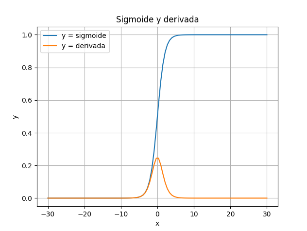

\vspace{1cm}

# Reconocimiento de patrones

Hasta ahora, tu red solo ha tenido que distinguir entre 4 combinaciones. Pero,
¿qué pasa cuando la entrada no son dos bits (0 o 1), sino una imagen de 28x28
píxeles de un número de 0 a 9 escrito a mano? El dataset MNIST es el "Hola
Mundo" del Deep Learning. Son imágenes de dígitos del 0 al 9. MNIST Es una
extensa colección de base de datos que se utiliza ampliamente para el
entrenamiento de diversos sistemas de procesamiento de imágenes. La base de
datos MNIST consta de 60.000 imágenes de entrenamiento y 10.000 imágenes de
prueba. Ahora nuestra entrada $X$ ya no es una matriz de 4×2. Ahora cada imagen
se aplana en un vector de 784 números (28 píxeles x 28 píxeles). Si procesamos
un *batch* o lote de 64 imágenes, $X$ será [64×784]. La salida $Y$ ya no es un
solo valor. Ahora necesitamos saber la probabilidad de que sea un 0, un 1, un
2... hasta el 9. Por tanto, la salida tiene 10 neuronas.

En el XOR usamos la Sigmoide, pero para redes más profundas existe un problema
importante con esta función: El gradiente desvanesciente o *Vanishing
Gradient*, del que hablaremos a continuación. Otro problema ahora es que en la
salida necesitamos varias neuronas, en concreto 10. Así cada una nos devolverá
una probabilidad de que el patrón de la entrada es el número asociado a
ellas. En el XOR, la salida era un valor entre 0 y 1. En clasificación de
números, queremos que la red nos diga: «Estoy un 80% seguro de que es un '5', un
15% de que es un '3' y un 5% de que es un '6'». Para esto usamos la función
Softmax en la última capa. Lo que hace es agarrar los valores brutos de salida y
convertirlos en una distribución de probabilidad que suma exactamente 100%.

$$
\text{softmax}(x_i) = \frac{e^{x_i}}{\sum e^{x_j}}
$$

En la red multicapa usamos para calcular el error que propagábamos la función
del Error Cuadrático Medio. Realmente usábamos su derivada justo en la línea
`error = y - predicted_output`. Si vemos la función del error cuadrático medio o
$E$ entendemos que su derivada sea la indicada en el código. El $\frac{1}{2}$ se
añade por pura conveniencia matemática para que se cancele al derivar:

$$
E = \frac{1}{2}(y - \hat{y})^2 \hspace{1cm} \frac{\partial E}{\partial \hat{y}} = -(y - \hat{y})
$$

En esta nueva red para reconocer patrones usaremos una nueva función para
calcular el error llamada **Entropía cruzada** o *Cross Entropy*. Su derivada es
mucho más agresiva. Si la red está muy segura de que un número es un "3" pero en
realidad es un "8", la Cross-Entropy genera un gradiente gigantesco para obligar
a la red a cambiar rápido. 

Esta nueva red tendrá la siguiente estructura:

* **Capa de Entrada** ($X$): Ya no son 2 bits. Aplanamos la imagen en un vector
  de $784$ neuronas. Pues cada imagen se aplana en un vector de $28x28 = 784$.

* **Capa Oculta**: Digamos que elegimos 128 neuronas para que la red tenga
  "memoria" suficiente para las formas de los números.

* **Capa de Salida**: Ahora necesitamos 10 neuronas (una para cada dígito del 0
  al 9).

El desarrollo matricial ahora nos quedaría de la siguiente forma:

$$Z_1 = X_{batch \times 784} \cdot W_{1 (784 \times 128)} + b_{1 (128)}$$

$$A_1 = \text{ReLU}(Z_1)$$

$$Z_2 = A_{1 (batch \times 128)} \cdot W_{2 (128 \times 10)} + b_{2 (10)}$$

$$A_2 = \text{Softmax}(Z_2)$$

El primer cambio se aprecia en $W_1$ donde vemos que tiene 100,352 pesos
(784×128). Esto es solo en la primera capa. El aumento de la complejidad es
apreciable pues pasamos de tener que reajustar apenas 4 pesos en esta primera
capa en el ejemplo anterior a más de 100 mil en este modelo.

Vamos ahora a resumir el bucle de entrenamiento igual que hicimos en la red
multicapa clásica del ejemplo para el XOR:

```
for epoch in range(epochs):
    # 1. Forward Pass con Softmax
    z1 = np.dot(X_train, W1) + b1
    a1 = relu(z1)  # Cambiamos Sigmoide por ReLU
    
    z2 = np.dot(a1, W2) + b2
    predicted_output = softmax(z2) 
    
    # 2. El gradiente con la Cross-Entropy
    d_output = predicted_output - y_train 
    
    # 3. Backpropagation
    error_hidden = d_output.dot(W2.T)
    d_hidden = error_hidden * relu_derivative(z1)
    
    # 4. Actualizacion
    W2 -= learning_rate * a1.T.dot(d_output)
    W1 -= learning_rate * X_train.T.dot(d_hidden)
```


En el XOR, tu salida era un punto. Aquí, tu salida es una distribución. Si la
red ve un "3" escrito de forma extraña, la neurona del "3" se encenderá mucho
(digamos 0.7), pero la del "8" también podría encenderse un poco (0.2) porque se
parecen. El Softmax es el que gestiona esa competencia entre neuronas. El valor
que devuelve en `predicted_output` será siempre un vector que sume 1 (por
ejemplo `[0.1, 0.0, 0.8, ...]`). El gradiente de la Entropia cruzada es
sorprendentemente simple: # (Predicción - Realidad). Si y_train es [0, 0, 1,
0...] (es un '2') # y predicted es [0.1, 0.1, 0.7, 0.1...], el error es la
diferencia. La fase de propagación del error hacia atrás es similar aunque ahora
usaremos la derivada de ReLU.  

## ReLU y el gradiente desvanesciente

El paso de Sigmoide a ReLU (Rectified Linear Unit) es, probablemente, el avance
más sencillo pero más importante que permitió que las redes neuronales pasaran
de tener 2 capas a tener cientos. Ya se ha explicado anteriormente el problema
del gradiente desvanesciente. Si observamos la curva de la sigmoide, vemos que
sus valores de entrada están comprimidos entre el 0 y el 1.

{width=60%}

El problema se encuentra en su derivada cuyo valor máximo es 0.25. Eso es cuando
la entrada es 0. Si no lo es, este valor se va rápidamente a 0. En una red con
múltiples capas como puede ser la necesaria para MNIST necesitamos aplicar la
regla de la cadena con todas ellas y acabamos multiplicando valores muy pequeños
(0.25 en el mayor de los casos) o incluso 0. El resultado es que las capas
profundas y cercanas a la salida si «aprenden» algo y actualizan sus pesos pero
a medida que nos acercamos a las primeras capas, a estas les llega el delta casi
reducido a 0 y por lo tanto no ajustarán sus pesos nada, ni se producirá
aprendizaje alguno. Para solucionar esto usaremos ReLU, cuya función está
formulada anteriormente. ReLU es una función "a trozos" extremadamente simple, y
ahí reside su genio:


$$
f(x) = \begin{cases} 
      0 & \text{si } x \le 0 \\
      x & \text{si } x > 0 
   \end{cases}
$$

Su derivada es la clave pues es similar. Para el primer caso es 1 y para el
segundo caso es 0. Al multiplicar gradientes en la Regla de la Cadena,
multiplicar por 1 no reduce la señal. El error viaja íntegro desde la salida
hasta la entrada, sin importar cuántas capas haya por medio. Esto permite que
las redes sean mucho más profundas. Además se produce una mejora computacional
importante debido a que es una función mucho más sencilla de computar (un simple
`if`). ReLU tiene un pequeño riesgo. Si una neurona recibe un golpe de gradiente
muy fuerte y sus pesos se vuelven tan negativos que su entrada siempre es $<0$,
su salida será siempre 0 y su derivada siempre 0. Esa neurona «muere» y deja de
aprender para siempre. De ahí que también usemos variantes como Leaky ReLU que
deja pasar un poquito de información negativa ($0.01x$) para que la neurona tenga
una oportunidad de «resucitar».


