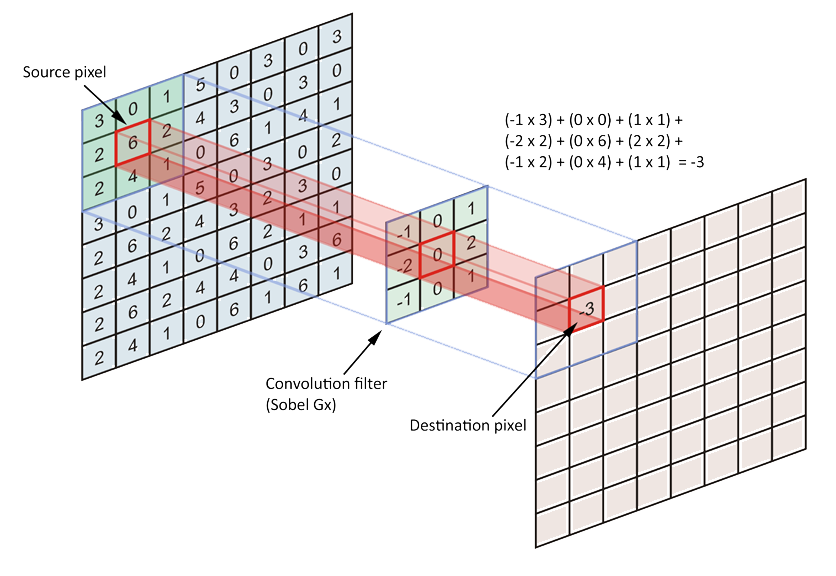

\vspace{1cm}

# Redes Neuronales Convolucionales

Anteriormente aplanamos una imagen de 28×28 a 784. Al hacer eso, la red ya no
sabe si el píxel 1 está al lado del píxel 2 o del píxel 28. Simplemente ve una
lista de números. Piensa en esto: ¿Cómo podrías tú reconocer una cara si te
dieran todos los píxeles de una foto mezclados en una bolsa? Sería
imposible. Las Redes Neuronales Convolucionales o CNN vienen a resolver
precisamente eso. Hasta ahora, las redes veían los píxeles como una lista
plana. Si movíamos el dibujo de un "8" un poco a la derecha, la red se confundía
porque los píxeles ya no caían en las mismas neuronas de entrada. Las CNN
solucionan esto imitando el córtex visual humano. En lugar de conectar cada
píxel a una neurona, usamos un filtro. Como si fuera una pequeña rejilla de 3×3
que se desliza sobre la imagen. Este filtro no mira toda la imagen a la vez;
mira solo un pequeño trozo, extrae una característica (como una línea vertical o
un borde) y se mueve al siguiente píxel. La red ahora no aprende a reconocer
«píxeles en tal posición», sino que aprende los valores de ese filtro que
detectan rasgos importantes (bordes, curvas, texturas). La estructura maestra de
una CNN podría resumirse en los siguiente puntos:

* **Capa de convolución**: Es el motor. Aquí es donde los filtros escanean la
  imagen. Si aplicas 32 filtros diferentes, obtendrás 32 mapas de
  características (versiones de la imagen donde resaltan cosas distintas).

* **Capa de pooling**: Es el sintetizador. Su trabajo es reducir el tamaño de la
  imagen. Toma, por ejemplo, un cuadrado de 2×2 y se queda solo con el valor más
  alto (el más brillante). Hacemos esto porque si detectamos un borde, no nos
  importa el píxel exacto, nos importa saber que ahí hay un borde. Esto hace que
  la red sea invariante a la traslación.

* **Capa totalmente conectada**: Al final de la red, después de que los filtros
  hayan extraído toda la información, volvemos a usar las capas que ya conoces
  para tomar la decisión final (¿Es un 8 o es un 3?).


A nivel global podemos resumir las funciones de las capas de la siguiente
manera. Mientras que las capas iniciales detectan cosas simples como líneas,
puntos y colores, las capas intermedias combinan esas líneas para detectar
formas como círculos, cuadrados, ojos, etc. Por último, las capas finales
combinan esas formas para detectar objetos complejos como caras, coches,
números, etc.

Vamos a empezar la red trabajando con una entrada en forma de matriz de
28x28. Ya no trabajamos con un vector plano como en las redes anteriores.
Usaremos para esta primera capa 32 filtros de 3x3. De esa capa salimos con una
matriz de 26x26 pues al aplicar filtros de 3x3 y deslizarlos por toda la imagen,
cuando llegamos a los bordes al tener que evitar que estos filtros se salgan
perdemos el equivalente a un marco de 1 por cada lado de la matriz. De ahí que
la matriz de 28x28 se quede en una de 26x26.

En la capa de *pooling* es donde se produce una compresión. Aplicando un Max
Pooling de 2x2 a la salida de 26x26 de la capa anterior, el pooling divide la
imagen en bloques de 2x2 y se queda con un máximo de uno. Esto reduce a la mitad
la matriz con un resultado de 13x13. Resumimos la arquitectura indicando los
tensores usados:

1. **Entrada**: [1x28x28] Tensor de 28x28 para un canal de color.

2. **Tras la convolución** con 32 filtros de 3x3: Obtenemos [32x26x26], lo que
   equivale a 32 versiones distintas de la imagen original, una por filtro
   usado.
   
3. **Tras el Pooling** de 2x2: Obtenemos [32x13x13]


Aunque ahora tenemos más datos (32 mapas en lugar de 1), estos datos están
jerarquizados. Cada uno de los 32 canales se especializa en algo: el canal 1
puede detectar líneas horizontales, el canal 2 detecta esquinas, etc

Pero antes de llegar a la salida (los 10 números del MNIST), tenemos que volver
al mundo que ya conoces. Si al final de las capas de convolución nos queda un
bloque de $32 \times 13 \times 13$, lo «aplanamos» multiplicando todas sus dimensiones:
$32 \times 13 \times 13=5408$ neuronas. Esas 5408 neuronas entrarán en una capa `nn.Linear`
clásica.


```
class NetCNN(nn.Module):
    def __init__(self):
        super(NetCNN, self).__init__()
        
        # 1. CAPAS CONVOLUCIONALES (Extraccion de rasgos)
        self.conv1 = nn.Conv2d(1, 32, kernel_size=3) 
        self.conv2 = nn.Conv2d(32, 64, kernel_size=3)
        self.pool = nn.MaxPool2d(2, 2)
        
        # 2. CAPAS LINEALES (Clasificacion)
        self.fc1 = nn.Linear(5 * 5 * 64, 128)
        self.fc2 = nn.Linear(128, 10)

    def forward(self, x):
        x = self.pool(F.relu(self.conv1(x)))
        x = self.pool(F.relu(self.conv2(x)))
        x = x.view(-1, 5 * 5 * 64) 
        
        x = F.relu(self.fc1(x))
        x = self.fc2(x) # Salida de 10 neuronas
        
        return F.log_softmax(x, dim=1)

``` 

Vamos a detallar ahora los aspectos mas interesantes del código. Comenzamos con
las dos capas convolucionales: `conv1` y `conv2`. ¿Por qué dos?  La respuesta
está en la jerarquía de la visión. Imagina que estás intentando reconocer una
cara. Con una sola capa (`conv1`), la red solo ve palitos y puntos (bordes). Es
imposible reconocer una cara solo sabiendo que hay 100 líneas
verticales. Necesitas saber si esas líneas forman un ojo, una nariz o una
boca. Ahí es donde entra la `conv2`. La clave de esta segunda capa es que no
mira la imagen original. Mira los mapas de características que creó la primera
capa. Por ejemplo, mientras que `conv1` detecta rasgos simples (bordes,
diagonales, manchas de color), `conv2` mira dónde hay bordes y los combina. Por
ejemplo: «Si aquí hay una curva hacia arriba y debajo una línea horizontal,
entonces aquí hay un semicírculo». Sin esa segunda capa, tu red sería como
alguien que ve las letras de un libro pero es incapaz de juntarlas para formar
palabras. Respecto a los canales (el primer parámetro de la función
`nn.Conv2d()`) en la `conv1` pusimos 32 filtros, pero en la `conv2`
pusimos 64. Al aumentar los canales en la segunda capa, le damos a la red un
«vocabulario» mucho más rico para describir lo que está viendo (curvas cerradas,
cruces, ángulos agudos, etc.). Estamos aumentando la semántica de la
red. Resumiendo, si quitamos la `conv2`, la red intentaría pasar directamente de
«detectar bordes» a «decidir si es un 8». Como no ha tenido una capa intermedia
para entender qué es un «círculo», le costará muchísimo generalizar. Tendría que
compensarlo con una capa lineal (`nn.Linear`) gigantesca y muy ineficiente.

Si vamos a la función `forward()` vemos que tras la primera convolución
aplicamos un *pooling* y tras la segunda otro. Al poner capas una tras otra
(especialmente con un Pooling de por medio), cada neurona de la capa 2 está
viendo un área mucho más grande de la imagen original que una neurona de la
capa 1. Una neurona en `conv1` solo mira 3×3 píxeles. No sabe si está en la
parte de arriba o de abajo de un número. Tras el *pooling* y la `conv2`, una
sola neurona de esa segunda capa puede estar recibiendo información que
originalmente cubría un área de 10×10 o más. Por eso se dice que esta segunda
capa tiene «perspectiva». Puede entender la geometría del número, no solo los
píxeles sueltos. A esto se le llama también campo receptivo.


## Funcionamiento de una capa convolucional

Vamos a describir brevemente la maquinaria dentro de una de estas capas
representadas por la función `Conv2d()`. Imagina que tienes la imagen de entrada
y sobre ella colocas una rejilla de 3×3 (el filtro). Cada celda de esa rejilla
tiene un peso (W). Entonces ocurre una operación matemática llamada convolución
(técnicamente, una correlación cruzada). La convolución es una operación
matemática fundamental que combina dos funciones (o señales), $f$ y $h$ para
producir una tercera que describe cómo una modifica a la otra. El proceso es más
o menos el siguiente:

1. El filtro se sitúa sobre los primeros 9 píxeles.
2. Multiplica cada píxel por su peso correspondiente en el filtro.
3. Suma los 9 resultados y añade el *bias*.
4. Ese resultado único se convierte en un solo píxel de la nueva imagen (el mapa de características).

{width=10cm}

La clave es que no hay un diseño previo del filtro, sino que es la red la que lo
aprende. Si un filtro tiene pesos negativos en la columna izquierda y positivos
en la derecha, cuando pase sobre una zona donde el color cambia de negro a
blanco, la suma dará un número muy alto. Acaba de encontrar un borde
vertical. Veamos un ejemplo para entender esto último. Tenemos un filtro de $3
\times 3$. Vamos a darle esos valores que mencioné: negativos a la izquierda y
positivos a la derecha.

$$
\text{Filtro} = \begin{bmatrix} -1 & 0 & 1 \\ -1 & 0 & 1 \\
-1 & 0 & 1 \end{bmatrix}
$$

Imagina que el filtro pasa por una zona de la imagen donde todos los píxeles son
blancos (valor 255). Multiplicamos cada píxel por su peso y observamos que la
suma total es $-765 + 0 + 765 = \mathbf{0}$. Este valor se intepreta como una
ausencia de cambios. No hay bordes.

- Columna izquierda: $255 \times (-1) + 255 \times (-1) + 255 \times (-1) =
  -765$
- Columna central: $255 \times 0 + 255 \times 0 + 255 \times 0 = 0$
- Columna derecha: $255 \times 1 + 255 \times 1 + 255 \times 1 = 765$

Ahora imagina que el filtro está justo encima de un borde. Los píxeles de la
izquierda son negros (0) y los de la derecha son blancos (255). Hacemos la misma
operación que antes y vemos que la suma total es mucho mayor: $0 + 0 + 765 =
\mathbf{765}$. Este valor tan alto lo interpretamos como que la red acaba de
detectar un contraste fuerte entre la izquierda y la derecha. En el mapa de
características resultante, ese píxel brillará con mucha fuerza.

$$
\text{Zona de la imagen} = \begin{bmatrix} 0 & 255 & 255 \\ 0 & 255 & 255 \\ 0 & 255 & 255 \end{bmatrix}
$$

- Columna izquierda (negra): $0 \times (-1) + 0 \times (-1) + 0 \times (-1) = 0$
- Columna central: $255 \times 0 + 255 \times 0 + 255 \times 0 = 0$
- Columna derecha (blanca): $255 \times 1 + 255 \times 1 + 255 \times 1 = 765$

El filtro que hemos puesto de ejemplo detecta bordes que pasan de negro a
blanco. Si el filtro fuera al revés (positivos a la izquierda y negativos a la
derecha), detectaría bordes que pasan de blanco a negro. Si los pesos estuvieran
en las filas superiores e inferiores, detectaría bordes horizontales. Si los
pesos estuvieran solo en las esquinas, detectaría diagonales. Antaño esos
filtros se escribían a mano. Hoy esos filtros se inicializan al azar para que
luego la red calcule los errores tras el entrenamiento y realice el
*backpropagation* visto anteriormente. Poco a poco, la red ajusta esos pesos
poco a poco hasta que, mágicamente, los 32 filtros se han convertido en
detectores perfectos de bordes horizontales, verticales, oblicuos, etc. La
segunda capa hace lo mismo, pero en lugar de multiplicar píxeles, multiplica los
«brillos» (activaciones) de la primera capa.  Si el Filtro de Bordes Verticales
brilló y el Filtro de Bordes Horizontales también brilló en el mismo sitio, un
filtro de la segunda capa diseñado para sumar ambos detectará una esquina.

Pero queda un asunto pendiente. Si tenemos 32 filtros, ¿qué impide que los 32
acaben siendo exactamente iguales si todos buscan minimizar el mismo error? La
respuesta es una combinación de caos inicial, especialización y matemáticas de
alta dimensión. Cuando creas la red, PyTorch no pone los filtros a cero. Si
todos empezaran en cero, todos recibirían el mismo gradiente y, efectivamente,
los 32 serían idénticos para siempre. En su lugar, los pesos se inicializan con
valores aleatorios muy pequeños. Así cada filtro empieza con una ligera
«tendencia» a buscar elementos concretos. Por ejemplo, el Filtro \#1 empieza con
una ligera tendencia a favor de los píxeles de arriba. El Filtro \#2 empieza con
una tendencia hacia los de la derecha y así sucesivamente. Como sus puntos de
partida son diferentes, cada filtro empieza a "caer" por una ladera distinta de
la montaña del error. Es muy difícil que dos filtros que empezaron en lugares
distintos acaben convergiendo exactamente al mismo diseño.  Además, cuando el
sistema intenta mejorar aún más, el algoritmo de optimización (el gradiente) «se
da cuenta» de que ya no gana mucho haciendo que el Filtro #2 también detecte
bordes verticales. Para reducir el error que queda (el error que el Filtro #1 no
puede solucionar), el Filtro #2 se ve empujado a buscar rasgos que el Filtro
#1 está ignorando, como bordes horizontales o curvas.

Matemáticamente, el espacio de posibles filtros es inmenso. En un filtro de 3×3
con valores decimales, hay infinitas combinaciones. En redes muy profundas, se
utilizan técnicas como la Regularización, que penaliza a la red si los pesos de
los filtros son demasiado parecidos entre sí, forzándolos a ser «ortogonales»
(matemáticamente independientes). Aunque en nuestra CNN básica para MNIST, el
simple hecho de empezar con valores aleatorios y tener un objetivo complejo
suele ser suficiente para que cada filtro encuentre su propio nicho
ecológico. Aunque antes de terminar con esto hemos de decir que a veces
ocurre. En redes gigantescas con miles de filtros, es común que algunos se
parezcan. Esto no es necesariamente malo; a veces la red usa esa redundancia
como un sistema de seguridad.


## El paso de la convolución a la clasificación

Vamos a explicar brevemente como pasamos la información de las capas de
convolución a las capas lineales o lo que es lo mismo, el paso del «Mapa de
Características» al «Vector de Clasificación». Mientras que las capas
convolucionales mantienen la estructura espacial (una imagen de 28×28 se
convierte en 32 imágenes de 13×13, etc.). Pero las capas finales (Linear) son
"ciegas" a la geometría; solo aceptan una lista larga de números. Para entender
bien este apartado resumimos el viaje de los datos y sus transformaciones a
través de las dos capas convolucionales.

0. Partimos de una imagen original como un cuadrado de 28x28 píxeles.

1. Primera parada: Conv1 (Filtro 3x3). Como vimos, al pasar un filtro de 3x3 sin
   "padding" (sin añadir bordes extra), perdemos un píxel por cada lado
   ($28-2=26$). Ahora tenemos mapas de 26x26.

2. Segunda parada: MaxPool1 (2x2). Ya dijimos antes que el Pooling es un
   resumidor. Toma bloques de 2x2 y los convierte en 1 solo píxel (el más
   brillante). Por tanto, divide el tamaño por 2 ($26/2=13$. Ahora tendremos
   mapas son de 13x13.

3. Tercera parada: Conv2 (Filtro 3x3). Volvemos a pasar un filtro de 3x3 sobre
   esos mapas de 13x13. Volvemos a perder un píxel por cada borde
   ($13-2=11$). Ahora tenemos mapas de 11x11.

4. Cuarta parada: MaxPool2 (2x2). Volvemos a dividir por 2. Como 11 es impar,
   PyTorch por defecto redondea hacia abajo ($11/2=5.5 \rightarrow 5$). En este punto por
   tanto, los mapas de características ahora miden 5x5.

Después de todo ese proceso, lo que le queda a la red es una versión minúscula
de la imagen original. Pero no es una imagen borrosa; es una destilación de
conceptos. Un píxel arriba a la izquierda podría significar: «Aquí hay una curva
cerrada». Un píxel en el centro podría significar: »Aquí hay un cruce de
líneas». Y como en la última capa convolucional pedimos 64 filtros, lo que
tenemos al final es 64 de esos cuadritos de 5x5. Para poder entrar en la capa
Linear, necesitamos una fila de neuronas. Así que estiramos (Flatten) todos
esos cuadritos y para ello usamos la instrucción: `x = x.view(-1, 64 * 5 * 5)`.  Con
esta instrucción lo que estamos haciendo es tomar ese «ladrillo» de datos de la
última capa de convolución y estirarlo. Donde 64 es el número de filtros
(conceptos complejos detectados) y 5x5 es el tamaño de la imagen resumida tras
pasar por las convoluciones y los poolings.

Si alguna vez cambias el tamaño del filtro (por ejemplo a 5x5) o añades más
capas, ese 5*5*64 cambiará. Si no actualizas el primer número de tu `nn.Linear`,
el programa fallará porque la puerta de entrada a la capa final no coincidirá
con la cantidad de datos que vienen de las convoluciones.


## El fenóneno del dropout

El Dropout es una de las técnicas más curiosas y efectivas en el Deep
Learning. Si las convoluciones son el "cerebro" de la red, el Dropout es su
entrenamiento militar. Imagina que tienes un equipo de 10 especialistas
trabajando en un proyecto. Si uno de ellos es muy dominante, el resto se vuelve
perezoso y deja de aprender, confiando siempre en lo que diga el líder. Si el
líder se equivoca, todo el equipo falla.

El Dropout consiste en apagar o poner a cero un porcentaje aleatorio de neuronas
en cada paso del entrenamiento. Esto obliga a la red a no depender de una sola
neurona o de un solo filtro para reconocer un número. Esto provoca que la red
desarrolle redundancia. Si apagas la neurona que detecta el «palito vertical del
4», la red se ve forzada a aprender otras formas de identificar el 4. Esto evita
el *Overfitting* (que la red se memorice los datos de entrenamiento pero falle con
imágenes nuevas).


### Conclusiones

Tras el entrenamiento y la prueba el colab de Google, el código mostrado en
`src/mnist-cnn.py` ha tardado 5 minutos en ejecutarse y ha mostrado los
siguientes errores medios para cada época:

```
Epoca 1 - Error medio: 0.2344
Epoca 2 - Error medio: 0.0833
Epoca 3 - Error medio: 0.0632
Epoca 4 - Error medio: 0.0524
Epoca 5 - Error medio: 0.0458
```

Frente a la antigua red MNSIT que no usaba CNN se ve de forma asombrosa que con
muchísimas menos épocas de entrenamiento, 5 en este caso frente a las 5000
anteriores llegamos a un error muy bajo igualmente. Mientras que la red lineal
sufría para llegar al 90%, una CNN básica como la nuestra superará el 98% o 99%
casi sin esfuerzo, porque «entiende» la estructura del número. Cuando la gente
habla de Deep Learning, se refiere precisamente a esto. **Al ir añadiendo capas,
estamos permitiendo que la red cree conceptos cada vez más abstractos**.


