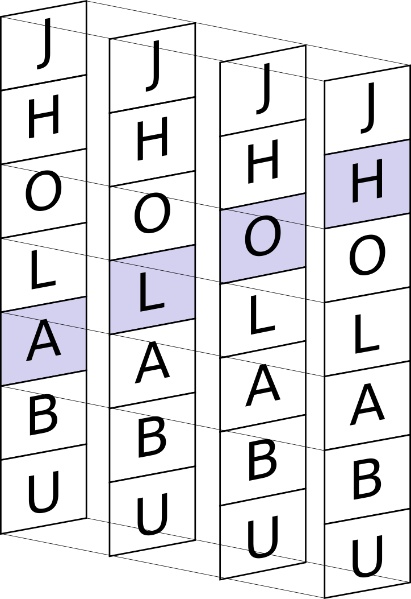

\vspace{1cm}

# Redes Recurrentes (RNN) y LSTM


Una red neuronal recurrente (RNN) es un tipo de red que contiene conexiones
recurrentes, es decir, conexiones en las que la salida de una neurona en un
instante se utiliza como entrada para otra neurona en el instante
siguiente. Esto permite a las RNNs capturar dependencias temporales y patrones
secuenciales.  A diferencia de las redes feed-forward tradicionales, donde las
operaciones se reducen principalmente a multiplicaciones de matrices y
transformaciones mediante funciones de activación, las RNN procesan datos
secuenciales manteniendo una memoria oculta (hidden state) que se actualiza en
cada paso temporal. Vamos a comenzar a desarrollar el concepto con un problema
clásico: la predicción de caracteres. Imagina que le enseñamos a la red la
palabra «HOLA». Si le damos la H, debe predecir la O y si le damos la O, debe
predecir la L y así sucesivamente. Pero para predecir la A, la red tiene que
«recordar» que antes vinieron la H, la O y la L. Si solo viera la L, no sabría
si la palabra es «HOLA», «PELO» o «ALTO».

En una CNN, los datos fluyen de entrada a salida y desaparecen. En una RNN, la
red tiene un bucle interno. Cada vez que la red procesa una letra, genera dos
cosas:

* Una salida: (La predicción de la siguiente letra).

* Un estado oculto ($h_t$): Una especie de memoria a corto plazo que se vuelve
  a meter en la red junto con la siguiente letra.
  
Las RNN básicas tienen un defecto de diseño: son muy buenas recordando lo que
pasó hace un segundo, pero pésimas recordando lo que pasó hace diez. Es el
problema del desvanecimiento del Gradiente o *vanishing gradient* del que ya
hemos hablado anteriormente en la sección \ref{desvanecimiento} pero llevado al
extremo. En una CNN o una red multicapa, tienes, por ejemplo, 5 o 10 capas
físicas. Pero en una RNN, si estás procesando una frase de 50 palabras, es como
si tuvieras una red de 50 capas de profundidad y además hay que tener en cuenta
un agravante: la matriz de pesos es la misma en cada paso. En una red normal,
cada capa tiene sus propios pesos ($W_1$, $W_2$, $W_3$, ...). En una RNN, aplicas
el mismo peso W una y otra vez para cada palabra.  Si la frase es muy larga, la
información de la primera palabra se diluye tanto que no llega al final. Por
eso, después de entender la RNN básica, pasaremos a las LSTM (Long Short-Term
Memory), que tienen una estructura especial para decidir qué recuerdos guardar y
cuáles borrar.


Para este ejemplo usaremos nombres de ciudades que vamos a intentar
predecir. Vamos a construir para ello un diccionario de caracteres. Esto es
esencial porque la red no entiende de letras, solo de posiciones en un
vector. Este un proceso llamado mapeado o *mapping*. Todo el código que se
muestra en esta sección está situado en `src/rnn.py` y ha sido probado con
Google Colab.


```
import torch
import numpy as np

ciudades = ["MADRID", "BARCELONA", "VALENCIA", "SEVILLA", "ZARAGOZA", 
            "MALAGA", "MURCIA", "PALMA", "BILBAO", "ALICANTE", 
            "CORDOBA", "VALLADOLID", "VIGO", "GIJON", "GRANADA"]

# 1. Crear el vocabulario 
alfabeto = sorted(list(set("".join(ciudades) + ".")))
char_to_int = {char: i for i, char in enumerate(alfabeto)}
int_to_char = {i: char for i, char in enumerate(alfabeto)}

n_letras = len(alfabeto)
print(f"Vocabulario: {alfabeto}")
```

Creamos la variable `alfabeto` con todas las letras involucradas en las palabras
que queremos predecir (además del punto) y, a partir de ellos, creamos los
diccionarios `char_to_int` y `int_to_char`.

Para entrenar la red, necesitamos pares de Entrada (X) y Objetivo (Y). Si la
palabra es MADRID.: Cuando ve M, el objetivo es A. Cuando ve A, el objetivo es
D. Y así seguiremos sucesivamente hasta que vea D, el objetivo es . (fin). Ahora
necesitamos convertir cada palabra a un tensor. Para ello usaremos la siguientes
funciones:

```
def palabra_a_tensor(palabra):
    tensor_x = torch.zeros(len(palabra), 1, n_letras)
    for i, char in enumerate(palabra):
        tensor_x[i][0][char_to_int[char]] = 1
    return tensor_x


def palabra_a_objetivo(palabra):
    indices = [char_to_int[char] for char in palabra[1:]]
    indices.append(char_to_int['.'])
    return torch.LongTensor(indices)
```

El tensor resultante será algo parecido al mostrado en la figura pero
almacenando los índices de cada letra en lugar de la propia letra en si
mima. Hay otros cambios, además de la modelización de los datos de entrada, con
respecto a las CNN anteriores. Por ejemplo, antes en las CNN el error se
calculaba al final de la imagen. Ahora calcularemos el error en cada letra. Si
la red predice E en lugar de A en M-A-D-R-I-D, ya tenemos un error que propagar
hacia atrás (Backpropagation Through Time).


{width=5cm}


Otra diferencia respecto a las CNN es que donde antes simplemente lanzabas el
modelo con el dataset de imágenes, ahora hay que inicializar la memoria en cada
palabra nueva. Si la red tiene 128 neuronas ocultas, su memoria inicial será un
vector de ceros de tamaño 128. A medida que lee cada letra, ese vector de ceros
se irá llenando con la esencia de lo que ha leído. **No hemos de confundir la
profundidad de la red con la cantidad de pasos que hemos de dar**. O dicho de otra
manera, la profundidad en capas de la red no depende de la longitud de las
palabras que queremos predecir. Cuando procesas una palabra como ZARAGOZA (8
letras), la RNN se «desenrolla» 8 veces, usando una y otra vez la misma
capa. Cada capa, eso sí, puede especializarse en estructuras complejas que irá
pasando a la siguiente (igual que hacíamos con los bordes y las esquinas
antes). Podemos tener una capa que aprenda a reconcer combinaciones de letras
como CH o LL y otra capa que aprenda a reconocer raíces de palabras o sufijos
(-ONA, o -ID). Normalmente, con 1, 2 o 3 capas es más que suficiente para
problemas de texto sencillo. Si pusiéramos 50 capas (una por cada letra), la red
sería imposible de entrenar por el problema del gradiente que comentamos antes.

Lo que define el tamaño de la palabra a procesar es el **tamaño de la memoria**,
también llamado *Hidden Size*. Cuanto más compleja sea la estructura que quieres
aprender (no más larga, sino más compleja), más grande debe ser ese *Hidden
Size*.


## Programando una RNN

En el ejemplo usamos un *Hidden Size* de 128, o lo que es lo mismo, 128 neuronas
de memoria (ancho de nuestra red). Son estas neuronas las que guardan el
recuerdo de lo leído. En nuestro caso, cuando la red lee la letra «M», escribe
algo en esas 128 libretas. Cuando pasa a la siguiente letra («A»), lee lo que
había en las 128 libretas y escribe encima la nueva información. Si usáramos un
*Hidden Size* de 2, la red solo tendría dos anotaciones para recordar qué ciudad
está escribiendo y, por tanto, es casi seguro que se olvidara de si empezó por
«M» o por «B» a la tercera letra. Si usáramos 1024, tendrá una memoria épica,
pero tardará mucho más en entrenar. En PyTorch, la capa `nn.RNN` devuelve dos
cosas: la salida de cada paso y el recuerdo final. Nosotros usaremos ese
recuerdo para decidir cuál es la siguiente letra. Esta capa es un contenedor que
automatiza el bucle, pero tú decides si lo usas para una letra o para toda la
palabra. Internamente esta capa tiene dos juegos de pesos:

* $W_{ih}$ (Input-to-Hidden): Lo que aprende de la letra que entra ahora.

* $W_{hh}$ (Hidden-to-Hidden): Lo que aprende de lo que ya había en la memoria.

De esta forma en cada paso de cada letra la capa hará:

$$
\text{Nuevo Hidden} = \tanh(W_{ih} \cdot \text{Letra} + W_{hh} \cdot \text{Hidden Anterior})
$$


```
import torch.nn as nn

class GeneradorCiudades(nn.Module):
    def __init__(self, input_size, hidden_size, output_size):
        super(GeneradorCiudades, self).__init__()
        self.hidden_size = hidden_size
        self.rnn = nn.RNN(input_size, hidden_size, batch_first=True)
        self.fc = nn.Linear(hidden_size, output_size)
    
    def forward(self, x, hidden):
        out, hidden = self.rnn(x, hidden)
        out = self.fc(out)
        return out, hidden

    def init_hidden(self):
        return torch.zeros(1, 1, self.hidden_size)


modelo = GeneradorCiudades(n_letras, 128, n_letras)
```


El entrenamiento es algo más dinámico que el desarrollado anteriormente. Para
cada ciudad, reseteamos la memoria, le metemos las letras una a una y castigamos
a la red si no adivina la siguiente. En este código se observa que usamos
`nn.RNN` dentro de un bucle en `for i in range(tensor_x....)`. En este caso
estamos usando `nn.RNN` «a mano». Esto quiere decir que le damos la letra «M»,
por ejemplo, y al estar la memoria vacía nos retorna una salida con una «M» en
la memoria. Luego le daremos la «A» con el recuerdo de la memoria con la «M» y
nos dará la salida con una memoria de recuerdo con «MA», y así
sucesivamente. Realmente podríamos hacer lo mismo prescindiendo de ese bucle
`for`. PyTorch permite pasarle la palabra entera («MADRID») de golpe a
`nn.RNN`. El módulo detectará que hay 6 letras y ejecutará el bucle internamente
6 veces, devolviéndote todas las salidas y la memoria final. Se ha hecho usando
el bucle simplemente para mejorar la comprensión del *Hidden Size* y de como
este fluye de letra a letra.

>La capa RNN funciona como si fuera un único empleado de una oficina. La entrada
>`x` sería el papel que le dejas al empleado sobre la mesa, el estado oculto o
>`hidden` es lo que el empleado mantiene en su cabeza al llegar por la
>mañana. La pasada o `forward` representa el empleado leyendo el papel, usando
>lo que tiene en su memoria y produciendo un informe de salida a la vez que
>actualiza lo que sabe para el día sigiente. El bucle for del que hemos hablado
>antes representa el paso de los días (o las letras).


```
criterion = nn.CrossEntropyLoss()
optimizer = optim.Adam(modelo.parameters(), lr=0.001)

# Entrenamiento simple
for epoch in range(1000):
    total_loss = 0
    for ciudad in ciudades:
        # 1. Preparar datos y resetear memoria
        tensor_x = palabra_a_tensor(ciudad)          # Ej: "MADRID"
        tensor_y = palabra_a_objetivo(ciudad)        # Ej: "ADRID."
        hidden = modelo.init_hidden()
        
        optimizer.zero_grad()
        loss = 0
        
        # 2. Bucle temporal (aqui es donde la red recorre la palabra)
        for i in range(tensor_x.size(0)):
            output, hidden = modelo(tensor_x[i].unsqueeze(0), hidden)
            loss += criterion(output.view(1, -1), tensor_y[i].unsqueeze(0))
        
        # 3. Optimizacion tras procesar TODA la palabra
        loss.backward()
        optimizer.step()
        total_loss += loss.item()
    
    if (epoch + 1) % 100 == 0:
        print(f"Epoca {epoch+1}/1000 - Error: {total_loss/len(ciudades):.4f}")
```


Vamos ahora a probar el modelo. Lo haremos con la función
`genera_ciudad(letra_inicio)`. Esta función toma la letra de inicio de una
ciudad y genera la ciudad más probable con esta letra. El problema sigue siendo
el contexto vacío. La memoria o el *Hidden* en este ejemplo se inicia cada
vez que lanzamos la función.


```
def generar_ciudad(letra_inicio):
    modelo.eval()
    with torch.no_grad():
        char = letra_inicio
        nombre = char
        hidden = modelo.init_hidden()

        for _ in range(15):
            x = palabra_a_tensor(char)
            output, hidden = modelo(x[0].unsqueeze(0), hidden)
            
            _, top_i = output.topk(1)
            char = int_to_char[top_i.item()]
            if char == '.': 
                break
            nombre += char

    return nombre
```


Para enriquecer el contexto y mejorar la predicción podríamos tener un vector
para «Ciudades del Norte» y otro para «Ciudades del Sur». De esta forma, si le
pasamos el vector «Norte» a la memoria inicial y luego le das la letra «B», la
red tendrá más predisposición a escribir `BILBAO` que `BARCELONA`. También
podríamos hacer que continuara una secuencia o *prompt*. Esa secuencia se puede
interpretar como un prefijo que «calienta» la memoria o el `hidden`.  Esto
demuestra que el `hidden_size` (las 128 anotaciones anteriormente mencionadas)
es realmente un resumen del pasado. No importa si ese pasado fue una letra o un
libro entero; si el resumen es bueno, la red sabe qué decir a continuación. Sin
embargo, aquí es donde la RNN básica suele fallar. Si le das un prefijo muy
largo, la influencia de la primera letra en ese hidden se habrá evaporado. Si
quisiéremos inicializar ese contexto o memoria con algo de información
adicional, como un prefijo podríamos usar la siguiente función.


```
def completar_ciudad(prefijo):
    modelo.eval()
    with torch.no_grad():
        hidden = modelo.init_hidden()
        
        # 1. "Calentamos" la memoria con el prefijo
        for i in range(len(prefijo) - 1):
            x = palabra_a_tensor(prefijo[i])
            _, hidden = modelo(x[0].unsqueeze(0), hidden)
        
        # 2. Ahora empezamos a generar desde la ultima letra del prefijo
        char = prefijo[-1]
        nombre = prefijo
        
        for _ in range(15):
            x = palabra_a_tensor(char)
            output, hidden = modelo(x[0].unsqueeze(0), hidden)
            
            _, top_i = output.topk(1)
            char = int_to_char[top_i.item()]
            
            if char == '.': 
                break
            nombre += char
            
    return nombre
```

De cualquier manera, si introducimos en nuestro dataset nombres o frases largas
como «LOS NIÑOS QUE CORREN POR EL PARQUE ESTÁN CANSADOS» o «LA NIÑA QUE CORRE
POR EL PARQUE ESTÁ CANSADA» veremos que aquí la red tiene que recordar el sujeto
(«LOS NIÑOS» o «LA NIÑA») a través de una distancia de 20 o 30 caracteres para
decidir si el final es «CANSADOS» o «CANSADA».  Esto lo podemos forzar usando un
dataset absurdo pero sature la memoria de la RNN, por ejemplo:

```
relleno = " - esto es solo texto de relleno para que la red se olvide - "
dataset_dificil = [
    f"ROJO{relleno}MANZANA.",
    f"VERDE{relleno}LECHUGA.",
    f"AZUL{relleno}OCEANO."
]
```

Si usamos ese dataset en lugar de `ciudades` y lanzamos el entrenamiento veremos
que al final, cuando intentamos predecir los resultados son totalmente
incorrectos. Por ejemplo, ante la instrucción `print(completar_ciudad("R"))`
ahora el programa retorna `ROJO - esto es .... olvide - OCEANO`. Debería haber
acabado con `MANZANA` pero claramente olvidó que el comienzo de la frase era
`ROJO`. Esto podrá solucionarse usando LSTM.


## El avance de las LSTM

Las *Long Short-Term Memory* o LSTM son un tipo avanzado de red neuronal
recurrente (RNN) diseñadas para aprender dependencias a largo plazo en datos
secuenciales, superando el problema del desvanecimiento del gradiente de las RNN
tradicionales. Utilizan una estructura interna de celdas con puertas (olvido,
entrada, salida) para controlar el flujo de información, almacenando o
descartando datos relevantes a lo largo del tiempo. A diferencia de las RNN
básicas, las LSTM gestionan una memoria a corto y largo plazo mediante estas
puertas que regulan la información. Estas puertas son:

1. **Puerta de Olvido** (Forget Gate): Mira la letra nueva y decide: «¿Sigo
necesitando recordar que la palabra empezaba por 'V' o ya puedo borrarlo?».

2. **Puerta de Entrada** (Input Gate): Decide qué información de la letra actual
   merece la pena guardarse en el «archivador».

3. **Puerta de Salida** (Output Gate): Decide qué parte de toda la memoria
acumulada vamos a usar para predecir la siguiente letra.

El estado oculto o *Hidden State* de antes también ha cambiado. Ahora está
compuesto por dos estructuras. Por un lado tenemos $h$ (Hidden State) que es,
básicamente, la memoria de trabajo (lo que pasó hace un segundo). Por otro lado
está $C$ o (Cell State) que es la memoria a largo plazo, o el «archivador» que
no se borra. De ahí que `init_hidden`, en el código inferior, retorne dos
tensores para cada una de estas estructuras.

```
class GeneradorCiudadesLSTM(nn.Module):
    def __init__(self, input_size, hidden_size, output_size):
        super(GeneradorCiudadesLSTM, self).__init__()
        self.hidden_size = hidden_size

        # CAMBIO CLAVE: nn.RNN -> nn.LSTM
        self.lstm = nn.LSTM(input_size, hidden_size, batch_first=True)
        
        self.fc = nn.Linear(hidden_size, output_size)
    
    def forward(self, x, hidden):
        # Ahora 'hidden' es una tupla (h, c)
        out, (h, c) = self.lstm(x, hidden)
        
        out = self.fc(out)
        return out, (h, c)

    def init_hidden(self):
        # La LSTM necesita DOS tensores de ceros: uno para h y otro para c
        return (torch.zeros(1, 1, self.hidden_size),
                torch.zeros(1, 1, self.hidden_size))

modelo_lstm = GeneradorCiudadesLSTM(n_letras, 128, n_letras)
```


Como se mencionó en la sección anterior, en la RNN básica multiplicábamos el
error por los pesos una y otra vez hasta que desaparecía. A eso lo llamábamos el
problema del gradiente desvanesciente. En la LSTM, el *Cell State* (C) es como
una cinta transportadora. El error puede viajar por esa cinta hacia atrás en el
tiempo sin ser multiplicado por pesos que lo reduzcan drásticamente.  Es un
camino libre de obstáculos para el gradiente. Usando PyTorch, el bucle de
entrenamiento es idéntico al de la RNN, pero notarás algo en los resultados. Por
ejemplo, si usamos un dataset incluso más «complicado» que el que saturó la RNN
antes, comprobaremos que el resultado si es el esperado.

```
relleno = " - esto es solo texto de relleno para que la red se olvide - "
ciudades = [
    f"ROJO{relleno}MANZANA.",
    f"VERDE{relleno}LECHUGA.",
    f"AZUL{relleno}OCEANO.",
    f"AMARILLO{relleno}PLATANO.",
    f"ROSA{relleno}PANTERA.",
    f"NEGRO{relleno}CARBON."
]
```

En este caso hemos aumentado el número de épocas a 5000 ya que las LSTM
necesitan algo más de «calentamiento» para sus puertas. Con ello, lanzando tras
el entrenamiento la instrucción `print(completar_ciudad("ROSA"))` ahora
obtenemos `ROSA - esto ... olvide - PANTERA`. La red ha sido capaz de completar
la predicción debido a que tiene la *Forget Gate*. Ella verá que el relleno no
ayuda a predecir la siguiente letra y decidirá no darle importancia, mientras
mantiene el valor de `ROJO` intacto en el *Cell State*.


## Aprendiendo conceptos (*Embeddings*)
